# Project I
## BCATU (E-Learning Platform)

#### Three Main Features provided by the website:

- (Resources) Notes, Presentation, Lab Reports
- Blogs
- Community Forum

#### Home Page

#### Login Page

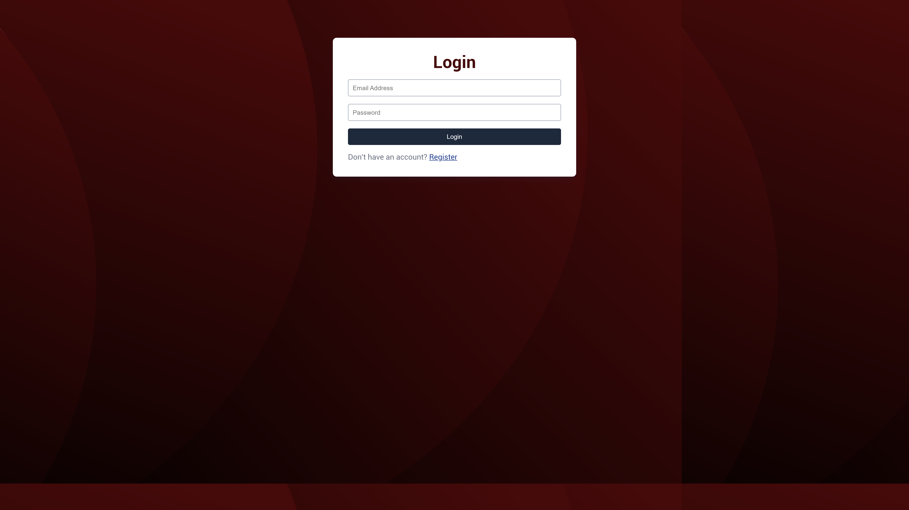

#### Registration Page

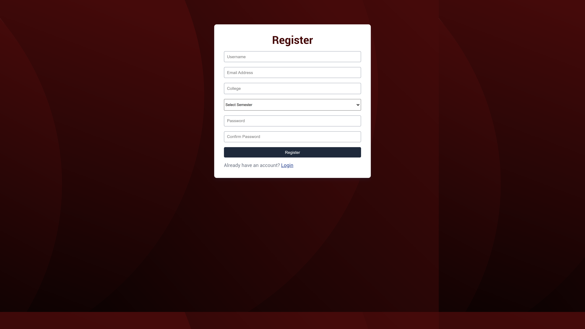

### Key Features

- serve website without login
- after registration and login
- user can have access of community, dashboard, and can add blogs

##

### (Resources)

#### Notes Page

#### View Notes Page

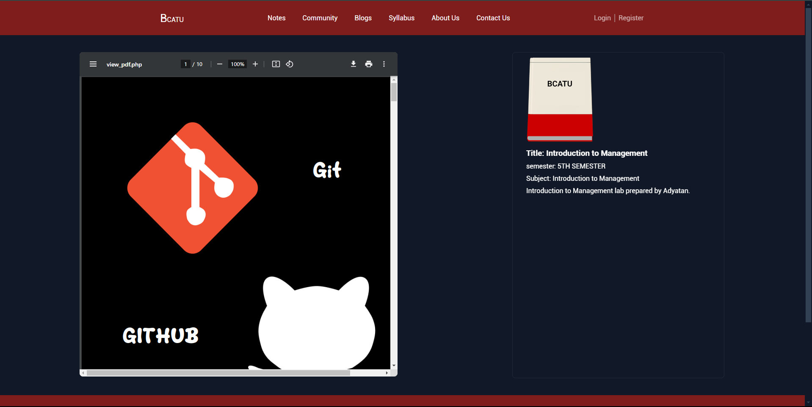

### Key Features

- search notes
- filter note with its type
- view and download notes

##

### Blogs

#### Blogs Page

#### Add Blogs Page

#### View Blogs Page

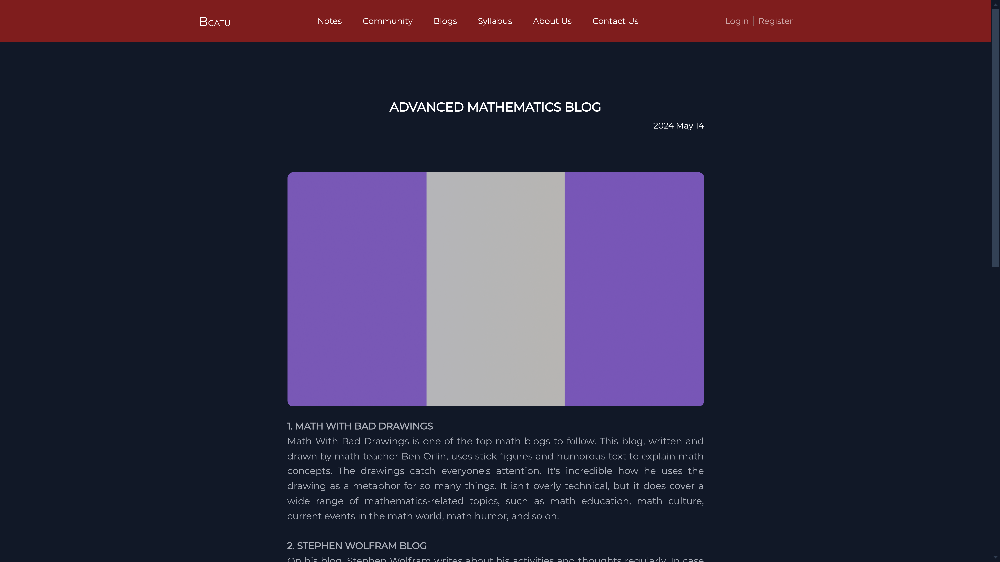

#### View Blogs with specific user Page

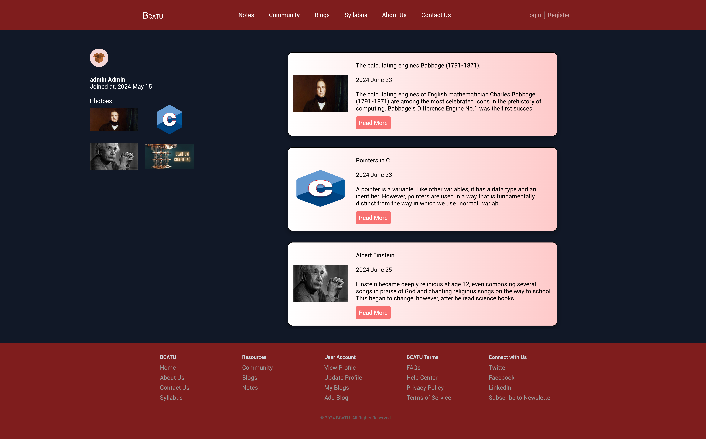

### Key Features

- filter blogs with category
- add blogs by user
- specific user uploaded blogs can see

##

### Community Forum

#### Community Forum Page

### Key Features

- user can raise questions
- other user can give answer
- its like QnA Session

##

### User Dashboard

#### User profile Page

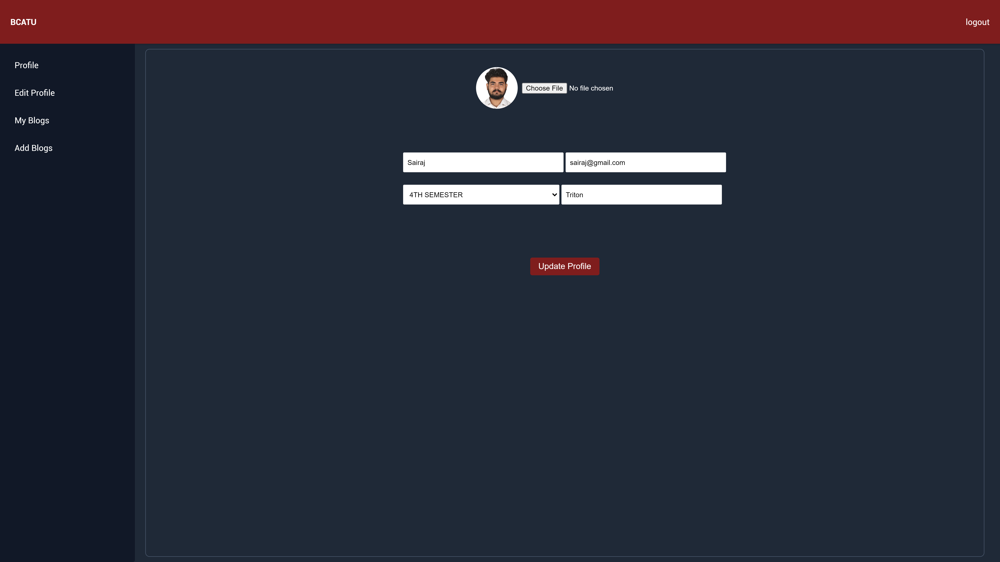

#### User Blogs Page

### Key Features

- user view profile
- user can edit profile
- user can manage her blogs

## Admin

#### Admin Dashboard

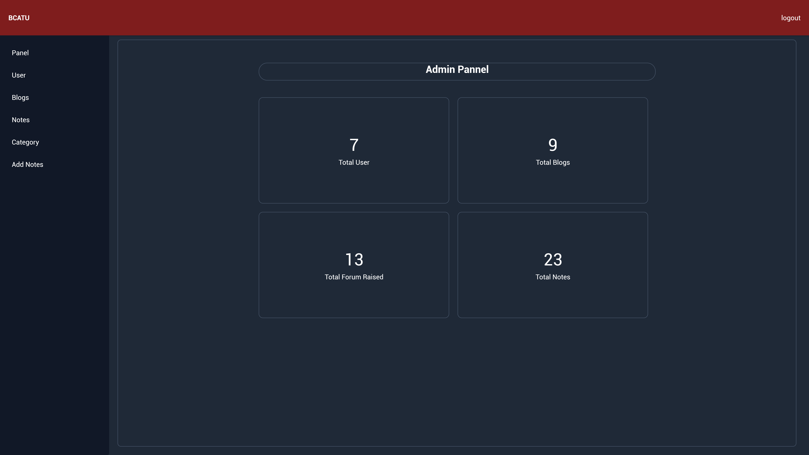

#### All User Management

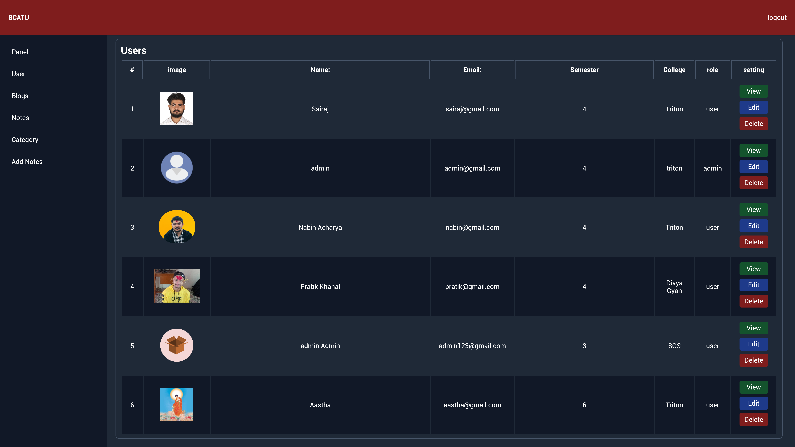

#### All Blogs Management

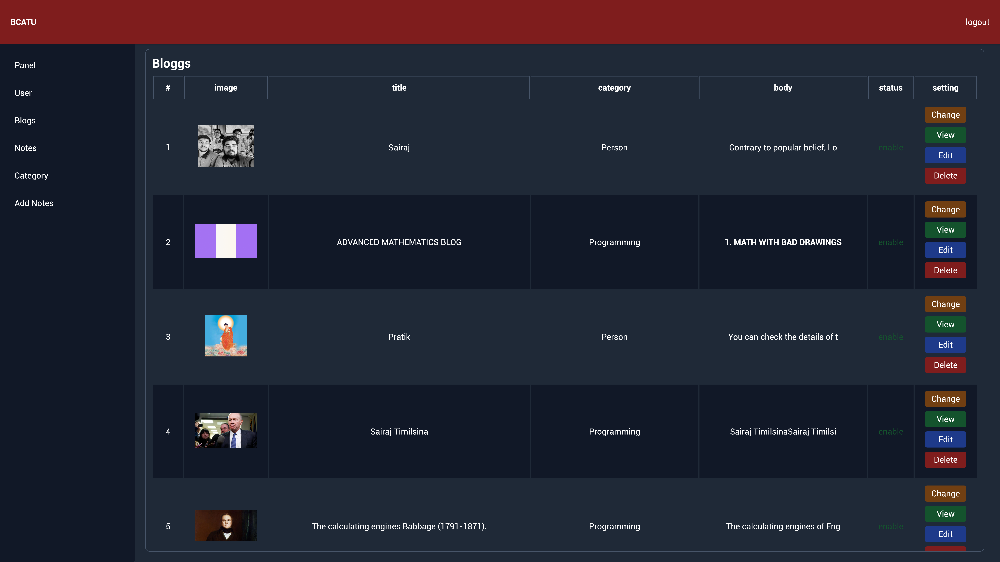

#### All Notes Management

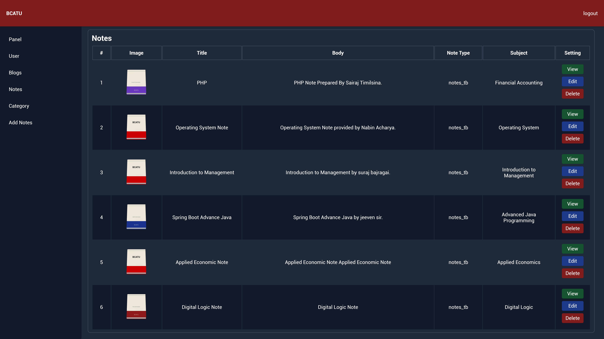

#### All Blog Category Management

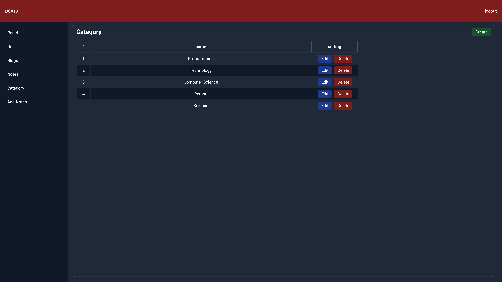

#### Add (Resources)

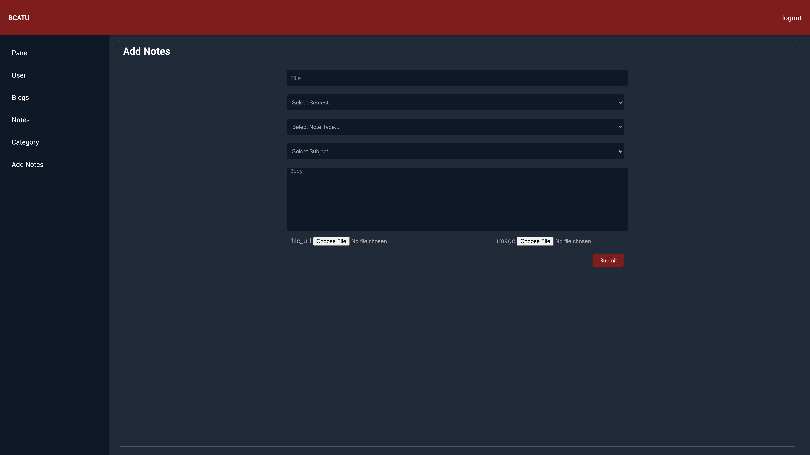

### Key Features

- Main Dashboard to view all (notes, blogs, forum raised, users)
- Admin can (edit, view, delete) user
- Admin can (change status, edit, view, delete) blogs
- Blogs are uploaded by user but in blogs page it will view if admin approves by change status
- Admin can (add, edit, view, delete) Blog category
- Admin can (add, edit, view, delete) Notes, Lab reports, Presentation pdfs

##

### File Structure

#### High Level Files

- admin
- assets
- config
- include
- pages
- index.php

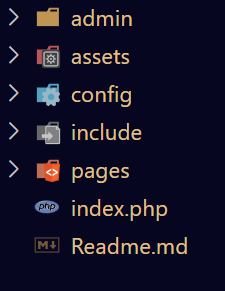

#### admin

- **assets:** All the images/css/jquery codes
- **config:** All the helper functions (Routes)/database connection/ logout code
- **include:** All the reusable components (header/footer) of Admin

- **pages:**
  - **blogs:** All the code related to `blogs`
  - **category:** All the code related to `category`
  - **notes:** All the code related to `notes`
  - **user:** All the code related to `user`
  - **index.php:** Main Dashboard code of admin

#### user

- assets
  - **css**: All the css code
  - **fonts**: All the fonts
  - **images**: All the images
  - **js**: All the js/jquery code
  - **uploads**: All the notes pdfs goes here
- **config:** All the helper functions (Routes)/database connection/ logout code
- **include**: All the reusable components (header/footer) of Admin
- pages
  - **aboutus**: All the aboutus code
  - **auth**: All the auth code
  - **blog**: All the blog code
  - **community**: All the community code
  - **contactus**: All the contactus code
  - **dashboard**: All the dashboard code
  - notes
    - **notes**: All the notes code
    - **syllabus**: All the syllabus code
- **index.php:** Home page

---

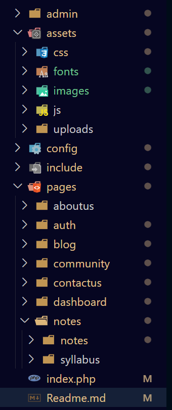

### Database Scheme

- BCATU Tables
  - User
  - Community
  - Blogs
    - Blogs category
  - Semester
    - subject
      - lab reports
      - presentation
      - notes

---

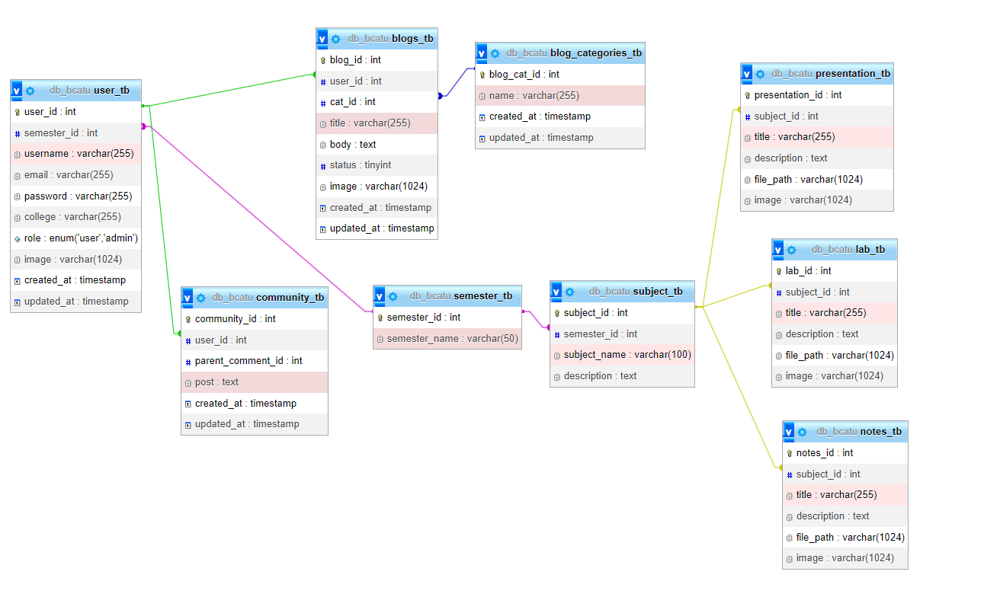
